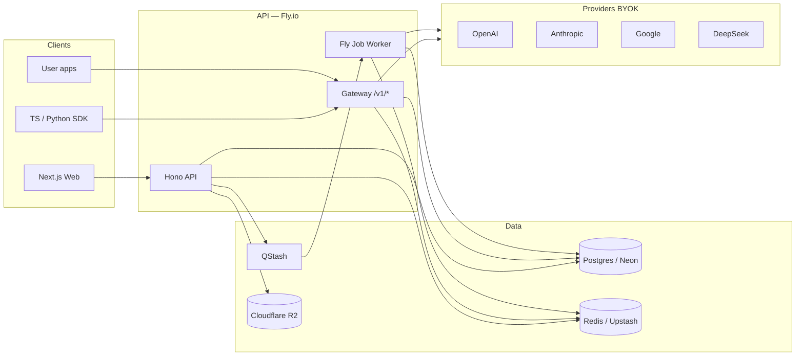

# LayerFlow — Backend Plan

> Companion to [features.md](features.md) (source of truth) and [product-strategy.md](product-strategy.md).  
> Definitive backend architecture for the complete LayerFlow product. Implementation order reflects technical dependencies, not separate disposable product phases.
> Last updated: July 2026

---

## 1. Goals

Build a backend that:

1. **Powers the Prompt Workspace** — domains, projects, folders, prompts, versions, compare.
2. **Powers the gateway/SDK as one feature** — OpenAI-compatible proxy + BYOK + hard budgets (same cost ledger).
3. **Scales solo → team** — one user / one workspace today; shared workspaces and multi-key later without a rewrite.
4. **Scales through the full product** — Workspace, Memory/Search, Cost Intelligence, Model Intelligence, Gateway, Learning, Community, Teams, files, billing, and analytics use one coherent architecture.

---

## 2. Recommended tech stack (primary)

**One primary stack.** Ship this unless something blocks you hard.

| Layer | Pick | Why |
|-------|------|-----|
| **Runtime / API** | **Node 22 + [Hono](https://hono.dev)** (separate service from Next.js) | Fast, typed, tiny. Great for streaming LLM proxies. Keep Next for UI only — gateway latency and scale shouldn’t share Next serverless cold starts / route limits. |
| **ORM / DB access** | **[Drizzle](https://orm.drizzle.team) + Postgres** | SQL you can read, migrations that don’t fight you, excellent TS types. Lighter than Prisma for a gateway hot path. |
| **Database** | **Postgres** ([Neon](https://neon.tech) primary) | Relational fit for workspace hierarchy + usage. Neon: branching for staging, scale-to-zero while solo. |
| **Auth** | **[Better Auth](https://www.better-auth.com) + direct Google OAuth only** | One “Continue with Google” flow. OAuth client comes from LayerFlow’s Google Cloud project; Better Auth securely manages state, cookies, sessions, and accounts in Postgres. |
| **Cache / budgets** | **Redis** ([Upstash](https://upstash.com)) | Atomic hard-budget reservations, rate limits, exact cache, session hot data. Redis is not durable product truth. |
| **Jobs** | **Upstash QStash + Fly worker** | Compare fan-out, embeddings, cost rollups, alert email, imports, and scheduled reports. |
| **Vector/search** | **Postgres FTS + trigram + pgvector on Neon** | Normal prompt search, AI Memory, semantic search, and semantic cache without adding Elasticsearch/MongoDB. |
| **Object storage** | **Cloudflare R2** | Prompt attachments, exports, generated files, and collection assets; Postgres stores metadata. |
| **Hosting (primary)** | **[Fly.io](https://fly.io)** | Always-on (or min 1) containers for streaming proxy; trivial horizontal scale; Docker = portable. Deploy `api` + later `worker`. |
| **Hosting (scale path)** | Fly multi-region → optional **Cloudflare Workers** edge for `/v1/*` gateway only | Keep workspace CRUD on Fly; push high-QPS proxy to edge when latency/cost demands it. |
| **Observability** | **[Better Stack](https://betterstack.com)** or **Axiom** + structured JSON logs + Sentry | Request IDs, latency, 5xx, gateway error rates. *Not* a full OpenTelemetry product — enough to debug your API. |
| **Email / billing / analytics** | **Resend + Stripe + PostHog** | Reports and alerts; subscriptions/entitlements; activation and usage analytics. |

### Alternatives (brief)

| Instead of | Alt | When |
|------------|-----|------|
| Hono service | NestJS | Only if you hire people who insist on Nest modules; slower to start. |
| Hono service | Next.js Route Handlers | Fine for Week 1 CRUD prototypes; **don’t** put the OpenAI-compatible gateway there long-term. |
| Drizzle | Prisma | OK if team prefers Prisma Studio; accept heavier client. |
| Better Auth | Auth.js | Only if Better Auth blocks direct Google OAuth/session requirements. Do not add Clerk/Auth0 while direct Google OAuth is the chosen product flow. |
| Neon | Railway / Supabase Postgres | Railway if you want one bill with app; Supabase if you already live there. |
| Fly | Railway | Slightly simpler DX; Fly wins for multi-region / gateway scale story. |
| Upstash | Redis on Fly | Fine when you outgrow serverless Redis pricing. |

**Frontend ↔ API:** The app at `https://layerflow.dev` calls `https://api.layerflow.dev` with a session cookie or bearer token.

---

## 3. High-level architecture



**Request paths**

1. **Workspace CRUD** — Web → Hono → Postgres (auth session).
2. **Compare** — Web → Hono enqueues job → Worker fans out to providers → results in Postgres → Web polls or SSE.
3. **Gateway** — SDK/app → `Authorization: Bearer lf_…` → Redis budget check → provider with decrypted BYOK → log usage → Redis cost increment → async persist run.

Ascii (same idea):

```
[Next.js] ──REST──► [Hono API] ──► Postgres
                         │
                         ├── Redis (budget, cache, queue)
                         │
[SDK/App] ──/v1/*──► [Gateway] ──► OpenAI / Anthropic / Google / DeepSeek
                         │              ▲
                         └──── BYOK keys (encrypted at rest)
```

---

## 4. Core domain model

Tenancy: **User** owns or joins **Workspace** records through `WorkspaceMember`. Create one default workspace after the first Google login; the same model supports teams without a schema rewrite.

| Entity | Purpose | Key fields |
|--------|---------|------------|
| **User** | Account | `id`, `email`, `name`, `createdAt` |
| **Workspace** | Root container | `id`, `ownerUserId`, `name`, `slug` |
| **Domain** | Top org lane (Marketing, Coding, …) | `id`, `workspaceId`, `name`, `slug`, `sortOrder` |
| **Project** | Under a domain | `id`, `domainId`, `name`, `status` (active/archived) |
| **Folder** | Nest under project | `id`, `projectId`, `parentFolderId?`, `name` |
| **Prompt** | Saved prompt unit | `id`, `workspaceId`, `projectId?`, `folderId?`, `title`, `currentVersionId?` |
| **PromptVersion** | Timeline entry | `id`, `promptId`, `version`, `body`, `modelHints?`, `createdAt` |
| **Run** | Single model call (workspace or gateway) | `id`, `workspaceId`, `promptVersionId?`, `source` (`compare` \| `playground` \| `gateway`), `provider`, `model`, `inputTokens`, `outputTokens`, `costUsd`, `latencyMs`, `status`, `requestId` |
| **CompareJob** | Fan-out compare | `id`, `promptVersionId`, `status`, `models[]` |
| **CompareResult** | Per-model outcome | `id`, `compareJobId`, `runId`, `rankHints` (best/cheap/fast — computed) |
| **Budget** | Hard monthly cap | `id`, `workspaceId`, `period` (`YYYY-MM`), `limitUsd`, `spentUsd` (also mirrored in Redis), `alertAtPct` (e.g. 80), `hardBlock` (bool) |
| **ApiKey** | LayerFlow gateway key | `id`, `workspaceId`, `name`, `keyHash`, `keyPrefix`, `budgetId?`, `dailyRequestCap?`, `revokedAt?` |
| **ProviderKey** | BYOK | `id`, `workspaceId`, `provider` (`openai` \| `anthropic` \| `google` \| `deepseek`), `ciphertext`, `keyHint` (last 4), `label` |

**Relations (simplified)**

```
User 1──* Workspace 1──* Domain 1──* Project 1──* Folder
                │                      └──* Prompt 1──* PromptVersion
                ├──* Budget
                ├──* ApiKey
                ├──* ProviderKey
                └──* Run
CompareJob 1──* CompareResult *──1 Run
```

**Core indexes:**
`(workspaceId)` on almost everything; `(promptId, version)`; `(workspaceId, createdAt)` on `Run`; unique `(workspaceId, period)` on `Budget`; unique hash on `ApiKey.keyHash`.

---

## 5. Complete API surface

Style: **REST + JSON** on Hono. (tRPC is fine *inside* the Next app only; public gateway must stay OpenAI-compatible REST.)

Base: `https://api.layerflow.dev/v1` for the gateway and `https://api.layerflow.dev/api` for workspace APIs.

### Auth

| Method | Path | Notes |
|--------|------|-------|
| GET/POST | `/api/auth/*` | Better Auth handlers; Google OAuth only |
| POST | `/api/auth/sign-out` | |
| GET | `/api/auth/session` | Current user + default workspace |

The frontend starts login with Better Auth `signIn.social({ provider: "google" })`; Better Auth owns the exact callback route under `/api/auth/*`.

### Workspace / structure / prompts

| Method | Path | Purpose |
|--------|------|---------|
| GET | `/api/workspaces/current` | Current tenant |
| PATCH | `/api/workspaces/:id` | Workspace settings |
| GET/POST | `/api/domains` | Domain list/create |
| PATCH/DELETE | `/api/domains/:id` | Edit/archive domain |
| GET/POST | `/api/projects` | Project CRUD; supports `?domainId=` |
| PATCH | `/api/projects/:id` | Rename/archive |
| GET/POST | `/api/folders` | Folder CRUD; supports `?projectId=` |
| PATCH/DELETE | `/api/folders/:id` | Edit/delete folder |
| GET/POST | `/api/prompts` | Prompt list/create |
| GET/PATCH/DELETE | `/api/prompts/:id` | Prompt detail/update/archive |
| GET | `/api/prompts/:id/versions` | Timeline |
| POST | `/api/prompts/:id/versions` | New immutable version |
| GET | `/api/prompts/:id/versions/:versionId` | Version snapshot |

Seed default domains on workspace create (Marketing, Coding, Study, Business, Research, Resume, Clients, School, Personal).

### Compare runs

| Method | Path | Purpose |
|--------|------|---------|
| POST | `/api/compare` | `{ promptVersionId, models[] }` → `compareJobId` |
| GET | `/api/compare/:jobId` | Job status + results |
| GET | `/api/runs` | Filter by prompt/project/model/source/date |
| GET | `/api/runs/:id` | Run detail and output |

### Budget & usage

| Method | Path | Purpose |
|--------|------|---------|
| GET | `/api/budgets/current` | Limits, spent, remaining, percentage |
| PUT | `/api/budgets/current` | Set hard daily/monthly limits |
| GET/PUT | `/api/budgets/scopes` | Project/API-key budget scopes |
| GET | `/api/usage/summary` | By day/project/model/key/prompt |
| GET | `/api/usage/alerts` | Warning and blocked states |
| GET | `/api/savings` | Actual vs Auto/cheaper-model estimate |

Hard block: gateway + compare refuse new paid calls when `spent >= limit` and `hardBlock`.

### Gateway proxy + API keys

| Method | Path | Purpose |
|--------|------|---------|
| GET/POST | `/api/keys` | LayerFlow API keys |
| DELETE | `/api/keys/:id` | Revoke |
| GET/POST | `/api/provider-keys` | BYOK CRUD |
| DELETE | `/api/provider-keys/:id` | Revoke and delete encrypted BYOK key |
| POST | `/v1/chat/completions` | OpenAI-compatible chat |
| POST | `/v1/responses` | OpenAI-compatible response API |
| GET | `/v1/models` | Union of enabled providers |

Auth for `/v1/*`: `Authorization: Bearer lf_live_…` (ApiKey), **not** session cookie.

---

## 6. Gateway design notes

1. **BYOK** — LayerFlow never exposes raw provider keys. User stores ProviderKeys; gateway decrypts in-memory per request, calls provider, then discards plaintext.
2. **Budget enforcement point** — **before** provider call:
   - Resolve `ApiKey` → `workspaceId` (+ optional key-level cap).
   - Redis: `GET budget:{workspaceId}:{YYYY-MM}` (or `INCRBY` reserved estimate).
   - If `spent >= limit` → `402` / OpenAI-shaped error: budget exceeded.
   - After success: increment Redis by actual cost; enqueue durable write to `Run` + Postgres `Budget.spentUsd`.
3. **Rate limits** — request/token caps per API key (Redis counter). Return `429` with `Retry-After`.
4. **Logging for cost** — store: model, tokens, costUsd, latency, apiKeyId, status, truncated prompt hash or short preview. **Do not** log full ProviderKey or raw `Authorization` headers. Full prompt/response bodies: store for workspace Runs; for high-volume gateway, sample or truncate (config flag).
5. **Caching** — exact hash cache in Redis, provider prompt-cache controls, and workspace-scoped semantic cache via pgvector; attribute “$ saved” on hits.
6. **Streaming** — pipe SSE/stream from provider; finalize token/cost on stream end (estimate mid-stream only for soft warnings, never for hard block settle).

---

## 7. External APIs / providers

| Provider | Use | Auth |
|----------|-----|------|
| **OpenAI** | GPT models; default OpenAI-compatible shape | User BYOK `sk-…` |
| **Anthropic** | Claude | User BYOK; adapt Messages API ↔ chat completions in gateway |
| **Google (Gemini)** | Gemini | User BYOK API key |
| **DeepSeek** | Cheap/fast option in Compare | User BYOK; OpenAI-compatible base URL |
| **Groq** | Low-latency open models | User BYOK; OpenAI-compatible API |
| **xAI** | Grok model family | User BYOK; OpenAI-compatible API |
| **OpenRouter** | Aggregated model access | User BYOK; OpenAI-compatible API |
| **Ollama/local** | Local development / zero API cost | User-configured local base URL; never reachable from hosted API unless tunnel/VPC configured |
| **AWS Bedrock** | Enterprise provider catalog | AWS credentials encrypted with the same provider-secret envelope |

**How keys work**

- User pastes key once in UI → server encrypts (AES-GCM) with `PROVIDER_SECRETS_KEK` (env / KMS later) → `ProviderKey.ciphertext`.
- Compare + gateway pick provider from requested `model` prefix or explicit map (`gpt-*` → openai, `claude-*` → anthropic, etc.).
- LayerFlow `ApiKey` is *your* product key (`lf_…`); it never replaces BYOK — it selects workspace, budget, and which ProviderKey to use.

**Pricing tables:** maintain a versioned `model_pricing` table with effective dates, input/output/cached-token rates, capabilities, context limits, and provider IDs. Refresh with a scheduled job and preserve old prices so historical runs remain correct.

---

## 8. Scalability

| Concern | Approach |
|---------|----------|
| **Horizontal API** | Stateless Hono on Fly (`fly scale count`); sessions in DB/Redis; secrets from env. |
| **Async compare** | POST compare → QStash job → Fly worker calls N providers in parallel with a concurrency limit → writes `CompareResult`s. |
| **Gateway hot path** | Redis budget + rate limit only; Postgres writes async via queue. |
| **DB indexes** | See §4; partition or archive `Run` by month when volume grows. |
| **Tenancy** | Every query scoped by `workspaceId` from session or ApiKey. No cross-workspace joins. Future teams = `WorkspaceMember(userId, role)` without changing row ownership model. |
| **Cache** | Exact Redis cache + provider context caching + workspace-scoped pgvector semantic cache. Never cache across workspaces. |

---

## 9. Security

| Rule | Detail |
|------|--------|
| **Secrets** | Provider keys encrypted at rest; KEK only in env / secrets manager. Rotate KEK with re-encrypt job later. |
| **ApiKeys** | Store **hash** (HMAC/SHA-256) + display prefix; show secret once at creation. |
| **Logging** | Redact `Authorization`, `api_key`, ciphertext, and plaintext provider keys. Structured logs with `requestId` only. |
| **Transport** | HTTPS only; HSTS at proxy. |
| **AuthZ** | Session user must own workspace; gateway key must match workspace. |
| **CORS** | Web origin allowlist; `/v1/*` open for server-side SDK clients. |
| **Budget** | Redis is live enforcement authority; immutable Postgres usage ledger is durable financial truth. Reconcile continuously. |

Production hardening includes key rotation, field encryption policies, backup/restore drills, abuse controls, and compliance evidence where required.

---

## 10. Full-product implementation order

This is one target architecture. The order exists only because each system depends on the previous security/data foundation.

1. Hono service, Drizzle/Neon, Google OAuth, tenancy, validation, deployment.
2. Workspace CRUD, prompts, immutable versions, sessions, attachments.
3. Provider adapters, real runs, streaming, token/cost settlement.
4. QStash compare jobs, ranking, replay, output history.
5. Redis budget reservations, usage ledger/rollups, alerts, Resend reports, Stripe.
6. Intelligence recommendations, Manual/Suggest/Auto, routing rules, savings insights.
7. Gateway `/v1/*`, BYOK, LayerFlow keys, SDKs, rate limiting, exact/provider/semantic cache.
8. AI Memory and Search using FTS + pgvector.
9. Learning, community, collections, teams, and social activity.
10. Production hardening: backups, reconciliation, load tests, migrations, abuse controls, auditability.

---

## Quick reference

| Decision | Choice |
|----------|--------|
| API | Hono on Node 22 (Fly.io) |
| DB | Postgres (Neon) + Drizzle |
| Auth | Better Auth + direct Google OAuth only |
| Redis | Upstash (budgets, cache, rate limits) |
| Jobs | Upstash QStash + Fly worker |
| Search | Neon FTS/trigram + pgvector |
| Files | Cloudflare R2 |
| Email / Billing | Resend / Stripe |
| Gateway | OpenAI-compatible `/v1/*` + BYOK + hard budget pre-check |
| Product heart | Workspace data model first; gateway reuses Run + Budget |

**Bottom line:** One Hono + Postgres/pgvector + Redis/QStash backend serves the complete product. Enforce hard budgets on the Redis hot path, keep an immutable Postgres usage ledger, encrypt BYOK keys, and use direct Google OAuth through Better Auth.
