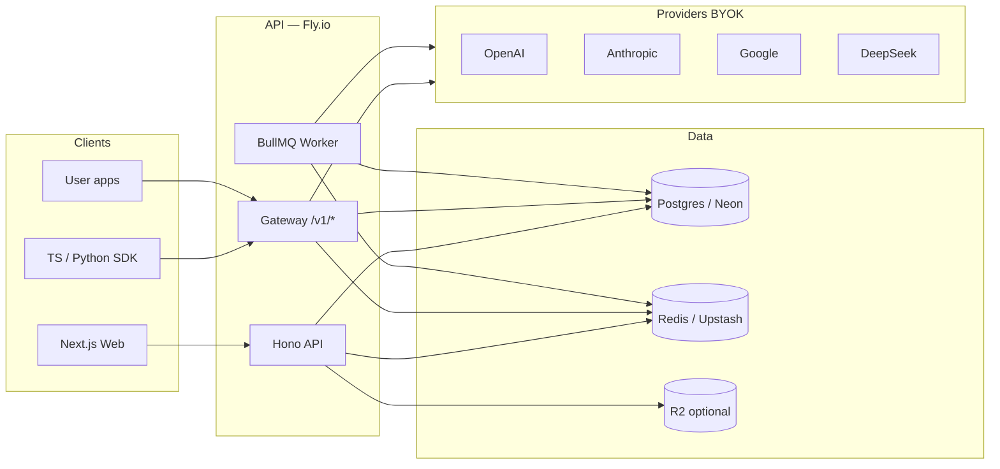

# LayerFlow — Backend Plan

> Companion to [features.md](features.md) (source of truth) and [product-strategy.md](product-strategy.md).  
> Frontend ships first; this doc locks backend direction so Week 1–4 MVP doesn’t thrash.  
> Last updated: July 2026

---

## 1. Goals

Build a backend that:

1. **Powers the Prompt Workspace** — domains, projects, folders, prompts, versions, compare.
2. **Powers the gateway/SDK as one feature** — OpenAI-compatible proxy + BYOK + hard budgets (same cost ledger).
3. **Scales solo → team** — one user / one workspace today; shared workspaces and multi-key later without a rewrite.
4. **Stays cheap and boring** — serverless-friendly Postgres + Redis; horizontal API; no enterprise control plane until buyers ask.

**Non-goals (now):** SSO, RBAC depth, SOC2, full OTel, semantic cache, smart router, self-host.

---

## 2. Recommended tech stack (primary)

**One primary stack.** Ship this unless something blocks you hard.

| Layer | Pick | Why |
|-------|------|-----|
| **Runtime / API** | **Node 22 + [Hono](https://hono.dev)** (separate service from Next.js) | Fast, typed, tiny. Great for streaming LLM proxies. Keep Next for UI only — gateway latency and scale shouldn’t share Next serverless cold starts / route limits. |
| **ORM / DB access** | **[Drizzle](https://orm.drizzle.team) + Postgres** | SQL you can read, migrations that don’t fight you, excellent TS types. Lighter than Prisma for a gateway hot path. |
| **Database** | **Postgres** ([Neon](https://neon.tech) primary) | Relational fit for workspace hierarchy + usage. Neon: branching for staging, scale-to-zero while solo. |
| **Auth** | **[Better Auth](https://www.better-auth.com)** | Self-hosted sessions in *your* Postgres; email + Google OAuth; owns user IDs for workspaces/keys. No per-MAU surprise tax early on. |
| **Cache / queue / budgets** | **Redis** ([Upstash](https://upstash.com)) + **BullMQ** (or Upstash Queues) | Atomic budget `INCR` / `INCRBYFLOAT` on every billed token. Exact-match cache. Async compare fan-out. Sub-ms checks on the gateway hot path. |
| **Object storage** | **Cloudflare R2** (optional Week 2+) | Large compare outputs / exports if you don’t want huge JSON in Postgres. Skip until payloads hurt. |
| **Hosting (primary)** | **[Fly.io](https://fly.io)** | Always-on (or min 1) containers for streaming proxy; trivial horizontal scale; Docker = portable. Deploy `api` + later `worker`. |
| **Hosting (scale path)** | Fly multi-region → optional **Cloudflare Workers** edge for `/v1/*` gateway only | Keep workspace CRUD on Fly; push high-QPS proxy to edge when latency/cost demands it. |
| **Observability** | **[Better Stack](https://betterstack.com)** or **Axiom** + structured JSON logs + Sentry | Request IDs, latency, 5xx, gateway error rates. *Not* a full OpenTelemetry product — enough to debug your API. |

### Alternatives (brief)

| Instead of | Alt | When |
|------------|-----|------|
| Hono service | NestJS | Only if you hire people who insist on Nest modules; slower to start. |
| Hono service | Next.js Route Handlers | Fine for Week 1 CRUD prototypes; **don’t** put the OpenAI-compatible gateway there long-term. |
| Drizzle | Prisma | OK if team prefers Prisma Studio; accept heavier client. |
| Better Auth | Clerk / Auth.js | Clerk = fastest Week 1 signup; migrate keys later if cost bites. |
| Neon | Railway / Supabase Postgres | Railway if you want one bill with app; Supabase if you already live there. |
| Fly | Railway | Slightly simpler DX; Fly wins for multi-region / gateway scale story. |
| Upstash | Redis on Fly | Fine when you outgrow serverless Redis pricing. |

**Frontend ↔ API:** Next.js calls `https://api.layerflow…` with session cookie or Bearer. Same origin via reverse proxy optional later.

---

## 3. High-level architecture



**Request paths**

1. **Workspace CRUD** — Web → Hono → Postgres (auth session).
2. **Compare** — Web → Hono enqueues job → Worker fans out to providers → results in Postgres → Web polls or SSE.
3. **Gateway** — SDK/app → `Authorization: Bearer lf_…` → Redis budget check → provider with decrypted BYOK → log usage → Redis cost increment → async persist run.

Ascii (same idea):

```
[Next.js] ──REST──► [Hono API] ──► Postgres
                         │
                         ├── Redis (budget, cache, queue)
                         │
[SDK/App] ──/v1/*──► [Gateway] ──► OpenAI / Anthropic / Google / DeepSeek
                         │              ▲
                         └──── BYOK keys (encrypted at rest)
```

---

## 4. Core domain model

Tenancy: **User** owns **Workspace**(s). MVP = 1 workspace per user (auto-created). Teams later = membership table, not a new product.

| Entity | Purpose | Key fields |
|--------|---------|------------|
| **User** | Account | `id`, `email`, `name`, `createdAt` |
| **Workspace** | Root container | `id`, `ownerUserId`, `name`, `slug` |
| **Domain** | Top org lane (Marketing, Coding, …) | `id`, `workspaceId`, `name`, `slug`, `sortOrder` |
| **Project** | Under a domain | `id`, `domainId`, `name`, `status` (active/archived) |
| **Folder** | Nest under project | `id`, `projectId`, `parentFolderId?`, `name` |
| **Prompt** | Saved prompt unit | `id`, `workspaceId`, `projectId?`, `folderId?`, `title`, `currentVersionId?` |
| **PromptVersion** | Timeline entry | `id`, `promptId`, `version`, `body`, `modelHints?`, `createdAt` |
| **Run** | Single model call (workspace or gateway) | `id`, `workspaceId`, `promptVersionId?`, `source` (`compare` \| `playground` \| `gateway`), `provider`, `model`, `inputTokens`, `outputTokens`, `costUsd`, `latencyMs`, `status`, `requestId` |
| **CompareJob** | Fan-out compare | `id`, `promptVersionId`, `status`, `models[]` |
| **CompareResult** | Per-model outcome | `id`, `compareJobId`, `runId`, `rankHints` (best/cheap/fast — computed) |
| **Budget** | Hard monthly cap | `id`, `workspaceId`, `period` (`YYYY-MM`), `limitUsd`, `spentUsd` (also mirrored in Redis), `alertAtPct` (e.g. 80), `hardBlock` (bool) |
| **ApiKey** | LayerFlow gateway key | `id`, `workspaceId`, `name`, `keyHash`, `keyPrefix`, `budgetId?`, `dailyRequestCap?`, `revokedAt?` |
| **ProviderKey** | BYOK | `id`, `workspaceId`, `provider` (`openai` \| `anthropic` \| `google` \| `deepseek`), `ciphertext`, `keyHint` (last 4), `label` |

**Relations (simplified)**

```
User 1──* Workspace 1──* Domain 1──* Project 1──* Folder
                │                      └──* Prompt 1──* PromptVersion
                ├──* Budget
                ├──* ApiKey
                ├──* ProviderKey
                └──* Run
CompareJob 1──* CompareResult *──1 Run
```

**Indexes (MVP):**  
`(workspaceId)` on almost everything; `(promptId, version)`; `(workspaceId, createdAt)` on `Run`; unique `(workspaceId, period)` on `Budget`; unique hash on `ApiKey.keyHash`.

---

## 5. API surface (MVP Weeks 1–4)

Style: **REST + JSON** on Hono. (tRPC is fine *inside* the Next app only; public gateway must stay OpenAI-compatible REST.)

Base: `https://api…/v1` for gateway; `https://api…/api` for workspace (or `/api/v1/...`).

### Auth

| Method | Path | Notes |
|--------|------|-------|
| POST | `/api/auth/sign-up` | Better Auth handlers (or mount Better Auth router) |
| POST | `/api/auth/sign-in` | Email / OAuth |
| POST | `/api/auth/sign-out` | |
| GET | `/api/auth/session` | Current user + default workspace |

### Workspace / structure / prompts

| Method | Path | Week |
|--------|------|------|
| GET | `/api/workspaces/current` | 1 |
| PATCH | `/api/workspaces/:id` | 1 |
| GET/POST | `/api/domains` | 1 |
| PATCH/DELETE | `/api/domains/:id` | 1 |
| GET/POST | `/api/projects` | 1 — `?domainId=` |
| PATCH | `/api/projects/:id` | 1 — rename / archive |
| GET/POST | `/api/folders` | 1 — `?projectId=` |
| PATCH/DELETE | `/api/folders/:id` | 1 |
| GET/POST | `/api/prompts` | 1 |
| GET/PATCH/DELETE | `/api/prompts/:id` | 1 |
| GET | `/api/prompts/:id/versions` | 2 |
| POST | `/api/prompts/:id/versions` | 2 — new timeline entry |
| GET | `/api/prompts/:id/versions/:versionId` | 2 |

Seed default domains on workspace create (Marketing, Coding, Study, Business, Research, Resume, Clients, School, Personal).

### Compare runs

| Method | Path | Week |
|--------|------|------|
| POST | `/api/compare` | 2 — `{ promptVersionId, models[] }` → `compareJobId` |
| GET | `/api/compare/:jobId` | 2 — status + results |
| GET | `/api/runs` | 2–3 — `?promptId=` / recent |
| GET | `/api/runs/:id` | 2 — include truncated I/O |

### Budget & usage

| Method | Path | Week |
|--------|------|------|
| GET | `/api/budgets/current` | 3 — limit, spent, remaining, % |
| PUT | `/api/budgets/current` | 3 — set monthly hard limit |
| GET | `/api/usage/summary` | 3 — by day / project / model / key |
| GET | `/api/usage/alerts` | 3 — 80% warn state |

Hard block: gateway + compare refuse new paid calls when `spent >= limit` and `hardBlock`.

### Gateway proxy + API keys

| Method | Path | Week |
|--------|------|------|
| GET/POST | `/api/keys` | 4 — LayerFlow API keys |
| DELETE | `/api/keys/:id` | 4 — revoke |
| GET/POST | `/api/provider-keys` | 4 — BYOK CRUD |
| DELETE | `/api/provider-keys/:id` | 4 |
| POST | `/v1/chat/completions` | 4 — OpenAI-compatible |
| POST | `/v1/completions` | 4 — optional thin stub |
| GET | `/v1/models` | 4 — union of enabled providers |

Auth for `/v1/*`: `Authorization: Bearer lf_live_…` (ApiKey), **not** session cookie.

---

## 6. Gateway design notes

1. **BYOK only for MVP** — LayerFlow never marks up tokens. User stores ProviderKeys; gateway decrypts in-memory per request, calls provider, discards plaintext.
2. **Budget enforcement point** — **before** provider call:
   - Resolve `ApiKey` → `workspaceId` (+ optional key-level cap).
   - Redis: `GET budget:{workspaceId}:{YYYY-MM}` (or `INCRBY` reserved estimate).
   - If `spent >= limit` → `402` / OpenAI-shaped error: budget exceeded.
   - After success: increment Redis by actual cost; enqueue durable write to `Run` + Postgres `Budget.spentUsd`.
3. **Rate limits** — soft daily request cap per ApiKey (Redis counter). Return `429` with `Retry-After`. Don’t build provider failover yet.
4. **Logging for cost** — store: model, tokens, costUsd, latency, apiKeyId, status, truncated prompt hash or short preview. **Do not** log full ProviderKey or raw `Authorization` headers. Full prompt/response bodies: store for workspace Runs; for high-volume gateway, sample or truncate (config flag).
5. **Exact-match cache (flag)** — hash `(model, messages)`; Redis GET/SET; attribute “$ saved” in usage UI when hit.
6. **Streaming** — pipe SSE/stream from provider; finalize token/cost on stream end (estimate mid-stream only for soft warnings, never for hard block settle).

---

## 7. External APIs / providers

| Provider | Use | Auth |
|----------|-----|------|
| **OpenAI** | GPT models; default OpenAI-compatible shape | User BYOK `sk-…` |
| **Anthropic** | Claude | User BYOK; adapt Messages API ↔ chat completions in gateway |
| **Google (Gemini)** | Gemini | User BYOK API key |
| **DeepSeek** | Cheap/fast option in Compare | User BYOK; OpenAI-compatible base URL |

**How keys work**

- User pastes key once in UI → server encrypts (AES-GCM) with `PROVIDER_SECRETS_KEK` (env / KMS later) → `ProviderKey.ciphertext`.
- Compare + gateway pick provider from requested `model` prefix or explicit map (`gpt-*` → openai, `claude-*` → anthropic, etc.).
- LayerFlow `ApiKey` is *your* product key (`lf_…`); it never replaces BYOK — it selects workspace, budget, and which ProviderKey to use.

**Pricing tables:** maintain a small `model_pricing` config (JSON or table) for cost estimates; refresh periodically. Good enough for MVP budgets.

**Not needed for MVP:** Azure OpenAI enterprise, Bedrock, custom self-hosted endpoints, LayerFlow-funded credits.

---

## 8. Scalability

| Concern | Approach |
|---------|----------|
| **Horizontal API** | Stateless Hono on Fly (`fly scale count`); sessions in DB/Redis; secrets from env. |
| **Async compare** | POST compare → BullMQ job → N provider calls in parallel with concurrency limit → write `CompareResult`s. Keeps HTTP fast and retries clean. |
| **Gateway hot path** | Redis budget + rate limit only; Postgres writes async via queue. |
| **DB indexes** | See §4; partition or archive `Run` by month when volume grows. |
| **Tenancy** | Every query scoped by `workspaceId` from session or ApiKey. No cross-workspace joins. Future teams = `WorkspaceMember(userId, role)` without changing row ownership model. |
| **Cache** | Exact-match optional; never cache across workspaces. |

---

## 9. Security

| Rule | Detail |
|------|--------|
| **Secrets** | Provider keys encrypted at rest; KEK only in env / secrets manager. Rotate KEK with re-encrypt job later. |
| **ApiKeys** | Store **hash** (HMAC/SHA-256) + display prefix; show secret once at creation. |
| **Logging** | Redact `Authorization`, `api_key`, ciphertext, and plaintext provider keys. Structured logs with `requestId` only. |
| **Transport** | HTTPS only; HSTS at proxy. |
| **AuthZ** | Session user must own workspace; gateway key must match workspace. |
| **CORS** | Web origin allowlist; `/v1/*` open for server-side SDK clients. |
| **Budget** | Treat Redis as source of truth for enforcement; reconcile to Postgres periodically. |

Defer: field-level encryption for prompt bodies, VPC, SOC2 evidence collection.

---

## 10. Phased build (align with frontend Weeks 1–4)

Frontend can mock; backend phases mirror the same weeks when you start API work.

| Phase | Aligns with | Ship |
|-------|-------------|------|
| **B0 — Skeleton** | Before / with W1 | Hono app, Neon, Drizzle schema, Better Auth, deploy Fly, healthcheck |
| **B1 — Workspace API** | Week 1 | Domains, projects, folders, prompts CRUD; seed domains |
| **B2 — Versions + Compare** | Week 2 | PromptVersion, Run, CompareJob/Result, Redis queue + worker, provider adapters (BYOK) |
| **B3 — Budgets** | Week 3 | Budget entity, Redis counters, usage summary, 80% alert flag, hard block in compare |
| **B4 — Gateway + keys** | Week 4 | ApiKey, ProviderKey encryption, `/v1/chat/completions`, soft rate limits, SDK pointing at gateway |

**After MVP:** exact-match cache flag, email weekly digest, shared workspaces, R2 for large outputs.

---

## 11. What NOT to build yet

- Enterprise SSO / SAML, deep RBAC, audit log product, self-host installs  
- SOC2 / HIPAA programs  
- Full OpenTelemetry / LangSmith-style traces UI  
- Semantic cache, smart auto-router, multi-provider failover  
- Prompt injection / PII / jailbreak scanners  
- Eval CI / regression platforms  
- Marketplace, collections backend, browser-extension sync  
- LayerFlow-resold LLM credits / markup billing  

---

## Quick reference

| Decision | Choice |
|----------|--------|
| API | Hono on Node 22 (Fly.io) |
| DB | Postgres (Neon) + Drizzle |
| Auth | Better Auth |
| Redis | Upstash (budgets, cache, queue) |
| Gateway | OpenAI-compatible `/v1/*` + BYOK + hard budget pre-check |
| Product heart | Workspace data model first; gateway reuses Run + Budget |

**Bottom line:** One Hono + Postgres + Redis backend serves Prompt Workspace and the developer gateway. Enforce hard budgets on the Redis hot path; encrypt BYOK; defer enterprise until someone pays for it.
