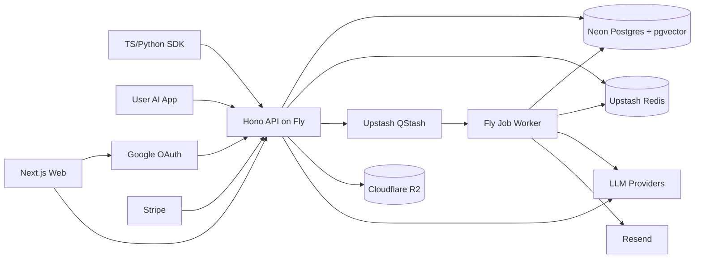

# LayerFlow — Completed Features & Backend Handoff

> **Purpose:** Founder learning + handoff doc. Use this to see **what the frontend currently demonstrates** and the **complete backend architecture required for the full product**.
> **When to use:** You finished the UI prototype and are about to start `apps/api` (or equivalent). Read this once, then keep [backend.md](backend.md) and [features.md](features.md) open while coding.  
> **Last updated:** July 2026

---

## 1. Title & purpose

This file bridges the **Next.js workspace UI** (built, mock data) and the **Hono API + Postgres backend** (not built yet).

| Question | Answer here |
|----------|-------------|
| What can I demo today? | Section 2 — every route and component, with mock vs real status |
| How does the UI behave without an API? | Section 3 — mock flows (save → version, sessions, compare, etc.) |
| What is still fake? | Section 4 |
| Which backend stack are we using? | Section 5 — one definitive stack |
| What must the full backend contain? | Sections 6–12 — folders, data, APIs, behavior, services, integration, build order |

**Rule of thumb:** If a screen reads from `lib/mock-data.ts` or `lib/prompt-analysis.ts`, it is **UI complete / not connected to API**.

---

## 2. What we built (completed — frontend only)

All workspace routes live under `app/(app)/`. Data comes from `lib/mock-data.ts` and client-side helpers. No `fetch()` to a real API yet.

### Module 1 — AI Workspace (core)

| Surface | Route | Key components | Status |
|---------|-------|----------------|--------|
| **Dashboard / Home** | `/workspace` | `PageHeader`, `DashboardCard`, `DomainCard`, `PromptList`, `SessionList`, `BudgetMeter`, `CostOptimizerBanner` | **UI complete · mock data · not connected to API** |
| **Domains grid** | `/workspace` (section) | `DomainCard` | **UI complete · mock data** — 9 domains in mock |
| **Projects list** | `/projects` | `PageHeader`, project cards from mock | **UI complete · mock data** |
| **Project detail** | `/projects/[projectId]` | folders list, `PromptList` | **UI complete · mock data** — "New folder/prompt" buttons are non-persistent |
| **Prompt library** | `/prompts` | `PromptList`, `FilterPills`, search input | **UI complete · mock data** — search/filters are visual only |
| **Prompt editor + Timeline** | `/prompts/[promptId]` | `PromptEditor`, `Timeline`, `PromptAnalysis` | **UI complete · mock save/versioning in React state · not connected to API** |
| **Prompt Sessions list** | `/sessions` | `SessionList` | **UI complete · mock data** |
| **Session detail (chain view)** | `/sessions/[sessionId]` | ordered prompts + latest outputs | **UI complete · mock data** — "Continue session" is non-functional |
| **Compare** | `/compare` | `ComparePanel` | **UI complete · mock results** — run button simulates delay only |

**Module 1 gaps (UI exists, behavior is mock):**

- Rollback / Replay / Export on Timeline → toast or local state only
- "New prompt", "New session", "New folder" → no persistence
- AI Memory / semantic search → not built
- Attachments on prompts → types exist, no UI flow

### Module 2 — AI Cost Manager

| Surface | Route | Key components | Status |
|---------|-------|----------------|--------|
| **Budget dashboard** | `/budget` | `BudgetClient`, `BudgetMeter`, `CostOptimizerBanner` | **UI complete · mock data · not connected to API** |
| **Per-project / per-key budgets** | `/budget` | progress bars from `projectBudgets`, `keyBudgets` | **UI complete · mock data** |
| **Spend by model, per-prompt spend** | `/budget` | static + mock lists | **UI complete · mock data** |
| **Token & cost estimator** | `/budget` | form with static `~$0.0024` | **UI complete · mock** — no live calculation wired to backend |
| **Blocked state preview** | `/budget` | `blockedBudget` demo | **UI complete · mock** — no server-side enforcement |
| **Cost Optimizer page** | `/optimizer` | `CostOptimizerBanner`, suggestions list, `ExecutionModeToggle` | **UI complete · mock data** |
| **Sidebar budget meter** | all app pages | `BudgetMeter` in `AppSidebar` | **UI complete · mock data** |

**Module 2 gaps:** Hard budget block on Run/Gateway, weekly email digest, 80% alert emails, real usage rollups.

### Module 3 — AI Model Intelligence

| Surface | Route | Key components | Status |
|---------|-------|----------------|--------|
| **Prompt analysis panel** | `/prompts/[promptId]` (in editor) | `PromptAnalysis`, `lib/prompt-analysis.ts` | **UI complete · rule-based mock** — regex/heuristics, not ML |
| **Execution modes** | `/settings`, `/optimizer` | `ExecutionModeToggle` | **UI complete · local state only** — Manual / Suggest / Auto-* |
| **Routing rules** | `/settings`, `/budget`, `/optimizer` | `RoutingRules` | **UI complete · mock data** — toggle in React state only |
| **Prefer cheap mode** | `/settings`, `/budget` | toggle switches | **UI complete · local state only** |
| **Optimizer suggestions** | `/optimizer` | hardcoded suggestion cards | **UI complete · mock data** |

**Module 3 gaps:** Server-side recommendation API, routing rule CRUD, Auto Mode actually selecting models on run, "Applied rule: …" on real runs.

### Module 4 — AI Gateway

| Surface | Route | Key components | Status |
|---------|-------|----------------|--------|
| **Gateway page** | `/gateway` | connection info, TS/Python/cURL snippets | **UI complete · mock config** — `gatewayConfig` from mock-data |
| **API keys list** | `/settings` | read-only list from `apiKeys` mock | **UI complete · mock data** — Create key button non-functional |
| **BYOK provider keys** | — | not on a dedicated screen yet | **Not built** — only mentioned in marketing copy |
| **Request logs** | — | — | **Not built** |

### Marketing (landing & acquisition)

| Surface | Route | Key pieces | Status |
|---------|-------|------------|--------|
| **Home / landing** | `/` | `Hero`, `PlatformFeatures`, `Journey`, etc. in `components/marketing/` | **UI complete · static content** from `lib/marketing-content.ts` |
| **Pricing** | `/pricing` | pricing tiers from marketing content | **UI complete · static** |
| **About** | `/about` | about copy | **UI complete · static** |
| **Features mega-menu** | Navbar on marketing pages | `Navbar.tsx` + `featureMenu` | **UI complete · links to workspace anchors and routes** |
| **Light / dark theme** | all pages | `ThemeToggle`, `lf-theme` in `localStorage`, `globals.css` | **UI complete · client-only** — no server preference sync |

CTA target: `site.workspaceHref` → `/workspace` (no auth gate).

### Settings (cross-cutting)

| Surface | Route | Status |
|---------|-------|--------|
| Profile, execution defaults, routing rules, API keys, budget defaults | `/settings` (`SettingsClient`) | **UI complete · mock / local state · not connected to API** |

---

## 3. How it works today (frontend mock flows)

These are the **demo loops** you can click through locally (`npm run dev` → `http://localhost:3000/workspace`). Nothing survives a full page reload unless it was already in `mock-data.ts`.

### Save prompt → auto version

1. Open `/prompts/[promptId]` (e.g. `prompt_sidebar`).
2. Edit title or body in `PromptEditor`.
3. Click **Save new version**.
4. Client creates a new `PromptVersion` in React state (`handleSave` in `PromptEditor.tsx`) with mock output text and estimates from `analyzePrompt()`.
5. `Timeline` updates via `onVersionCreated` — shows vN with model, cost, tokens.
6. **Not persisted** — refresh loses unsaved mock edits unless they were in seed data.

### Session conversation chain

1. Go to `/sessions` → pick e.g. **Resume Builder**.
2. `/sessions/session_resume_builder` shows prompts 1 → 2 → 3 in order with latest version output per step.
3. Each step links to full prompt detail.
4. **Continue session** does not call an API or append runs.

### Model analysis panel

1. On prompt detail, typing in the editor triggers `analyzePrompt(content, model)` (`lib/prompt-analysis.ts`).
2. Panel shows estimated tokens, cost, task type, **Cheapest good-enough** vs **Best Quality**, and **Why** bullets.
3. **Use recommended** switches the model `<select>` only — no run.
4. Logic is keyword/heuristic (e.g. `/code|react|api/` → coding task).

### Budget / optimizer callouts

1. `CostOptimizerBanner` on `/workspace`, `/budget`, `/optimizer` shows: *"You spent $42; could have been $11 with Auto Mode"* (hardcoded props).
2. `/budget` shows monthly/daily meters, per-project/key caps, blocked preview via `blockedBudget`.
3. Sidebar `BudgetMeter` always reads static `budget` from mock-data.
4. Toggles (prefer cheap, routing rules) update React state only.

### Compare

1. `/compare` loads pre-baked `compareResults` from `lib/compare-results.ts`.
2. Edit prompt text, click **Compare all models** → 1.5s loading animation, same static results.
3. Badges: **Best**, **Cheapest**, **Fastest** computed client-side from mock metrics.

---

## 4. What is NOT built yet

### Product surfaces not represented in the current frontend

See [features.md](features.md) for the current product scope. Learning, community, collections, teams, and enterprise administration are included in the full architecture below but do not yet have completed frontend surfaces.

### Features still missing (frontend and/or backend)

| Area | Missing |
|------|---------|
| **Backend** | No `apps/api/`, no Postgres, no Redis, no workers |
| **Auth** | No sign-up/login, no sessions, no workspace tenancy |
| **Real LLM calls** | Run, Replay, Compare, Session continue — all mock |
| **Persistence** | CRUD for domains/projects/folders/prompts/sessions/versions |
| **Hard budget enforcement** | No 402/block on API or Run |
| **Real cache** | Dashboard "cache saved" is demo copy only |
| **Email** | Weekly digest, 80% budget alerts |
| **BYOK UI** | Provider key add/revoke/encrypt |
| **Gateway** | No `/v1/chat/completions`, no real `lf_live_` keys |
| **SDK packages** | `@layerflow/sdk` snippets are illustrative only |
| **AI Memory / search** | Search box on `/prompts` does not query |
| **Learning / Community / Teams** | Included in the full backend target below; frontend not started |

---

## 5. Definitive backend stack — full product

This is the one stack LayerFlow will use. It supports the complete product: workspace, prompt history, sessions, AI Memory/Search, compare, cost intelligence, model routing, hard budgets, gateway, learning, community, teams, attachments, billing, email, and analytics. Engineering still has a dependency order, but the architecture does not split the product into disposable “Phase 1 vs Phase 2” systems.

### 5.1 Stack decisions

| Layer | Use | Purpose |
|-------|-----|---------|
| **Web frontend** | **Next.js 16 + React 19 + TypeScript + Tailwind 4**, Vercel | Existing marketing and workspace app |
| **Backend runtime** | **Node.js 22 + Hono** | Typed REST API, streaming LLM gateway, webhooks |
| **API hosting** | **Fly.io** (Docker, minimum one instance) | Long-lived streaming, workers, horizontal scaling |
| **Primary database** | **Neon Postgres** | All durable relational product data |
| **ORM / migrations** | **Drizzle ORM + drizzle-kit** | Typed SQL schema and migrations |
| **Vector / semantic search** | **pgvector in Neon Postgres** | AI Memory, semantic prompt search, semantic cache |
| **Text search** | **Postgres full-text + trigram indexes** | Prompt title/body/tag search without another database |
| **Fast counters / cache** | **Upstash Redis** | Hard budgets, rate limits, exact cache, sessions hot data |
| **Background jobs** | **Upstash QStash + Fly worker** | Compare fan-out, embeddings, weekly reports, alerts, imports |
| **File storage** | **Cloudflare R2** | Attachments, exports, generated files, collection assets |
| **Auth** | **Better Auth with Google OAuth only** | Direct “Continue with Google”; sessions stored in Postgres |
| **Email** | **Resend + React Email** | Budget alerts, weekly reports, transactional email |
| **Billing** | **Stripe Billing + webhooks** | Free/Pro/Team subscriptions and entitlement checks |
| **Product analytics** | **PostHog** | Activation, funnels, feature use |
| **Errors** | **Sentry** | Frontend/API errors and performance |
| **Logs** | **Axiom** | Structured API/gateway logs, request IDs |
| **LLM adapters** | Official SDKs + OpenAI-compatible `fetch` adapters | OpenAI, Anthropic, Gemini, DeepSeek, Groq, xAI, OpenRouter |
| **Shared contracts** | **Zod + TypeScript package** | Request validation and frontend/backend types |

### 5.2 Why only one durable database

**Neon Postgres is the source of truth.** Do not add MongoDB, Firebase, Supabase DB, or Elasticsearch.

- Relational workspace hierarchy fits Postgres.
- JSONB handles provider metadata, prompt variables, and routing conditions.
- `pgvector` handles semantic memory/search/cache.
- Full-text + trigram indexes handle normal search.
- Redis is not a second source of truth; it only accelerates counters/cache.
- R2 stores binary files; Postgres stores their metadata and permissions.

### 5.3 Google direct authentication

LayerFlow will show **one button: “Continue with Google.”**

Do not manually implement OAuth security. Use **Better Auth’s Google provider**, connected directly to a LayerFlow Google Cloud OAuth client:

1. Create a Google Cloud project.
2. Configure OAuth consent screen.
3. Create a Web OAuth Client ID.
4. Add local and production redirect URIs.
5. Put `GOOGLE_CLIENT_ID` and `GOOGLE_CLIENT_SECRET` in backend secrets.
6. Better Auth handles OAuth state/PKCE, secure cookies, session rotation, account linking, and Postgres session records.
7. On the first successful login, create the user’s default workspace and domains.
8. Every `/api/*` request resolves `session → userId → workspace membership`.

There is no email/password signup in the first complete product. A user’s Google email is the account identity. Team invitation emails can still be sent through Resend.

### 5.4 Full architecture



---

## 6. Full backend folder structure

```text
LayerFlow/
├── app/                              # Existing Next.js frontend
├── components/                       # Existing marketing/workspace UI
├── lib/
│   ├── api-client.ts                 # CREATE: typed frontend calls
│   └── types.ts                      # Move later into shared package
├── apps/
│   ├── api/
│   │   ├── src/
│   │   │   ├── index.ts
│   │   │   ├── config/
│   │   │   ├── middleware/           # auth, tenancy, rate limit, errors
│   │   │   ├── auth/                 # Better Auth + Google provider
│   │   │   ├── db/
│   │   │   │   ├── schema/
│   │   │   │   ├── migrations/
│   │   │   │   └── repositories/
│   │   │   ├── routes/
│   │   │   │   ├── workspace/
│   │   │   │   ├── prompts/
│   │   │   │   ├── sessions/
│   │   │   │   ├── compare/
│   │   │   │   ├── intelligence/
│   │   │   │   ├── budgets/
│   │   │   │   ├── memory/
│   │   │   │   ├── learning/
│   │   │   │   ├── community/
│   │   │   │   ├── billing/
│   │   │   │   └── gateway/
│   │   │   ├── services/
│   │   │   ├── providers/            # OpenAI, Claude, Gemini, etc.
│   │   │   ├── gateway/              # OpenAI-compatible /v1
│   │   │   ├── intelligence/         # analyze, recommend, route, savings
│   │   │   ├── budgets/              # reserve, settle, block
│   │   │   ├── search/               # FTS + pgvector
│   │   │   ├── cache/                # exact + semantic
│   │   │   ├── storage/              # R2 signed URLs
│   │   │   ├── jobs/                 # QStash producers
│   │   │   └── webhooks/              # Stripe, QStash callbacks
│   │   └── Dockerfile
│   └── worker/
│       ├── src/jobs/                  # compare, embeddings, email, imports
│       └── Dockerfile
├── packages/
│   ├── contracts/                     # Zod schemas + shared TS types
│   ├── model-registry/                # prices, capabilities, token limits
│   ├── sdk-typescript/
│   └── sdk-python/
└── docs/
```

---

## 7. Complete data model

### Accounts and tenancy

`users`, `accounts`, `sessions`, `verification_tokens` (Better Auth), `workspaces`, `workspace_members`, `invitations`, `subscriptions`, `entitlements`.

### Workspace and prompt management

`domains`, `projects`, `folders`, `prompts`, `prompt_versions`, `prompt_variables`, `prompt_tags`, `prompt_attachments`, `prompt_outputs`, `prompt_sessions`, `session_messages`, `favorites`, `activity_events`.

Every prompt edit inserts an immutable `prompt_versions` row. Rollback creates a **new version** based on an old snapshot; it never rewrites history.

### Runs, compare, intelligence

`runs`, `compare_jobs`, `compare_results`, `prompt_analyses`, `model_recommendations`, `routing_rules`, `workspace_settings`, `model_pricing`, `model_performance`, `savings_insights`.

Every real model call creates a `run` containing provider, model, estimated/actual tokens, cost, latency, cache status, recommendation explanation, and budget decision.

### Costs and gateway

`budgets`, `budget_scopes`, `usage_ledger`, `usage_rollups`, `api_keys`, `provider_keys`, `gateway_logs`, `rate_limit_policies`, `cache_entries`.

Money is stored as integer **micro-dollars**, never floating point. API keys are HMAC-hashed. Provider keys are AES-256-GCM encrypted with a server KEK/KMS key.

### Memory, learning, community

`memories`, `memory_embeddings`, `learning_paths`, `lessons`, `challenges`, `challenge_submissions`, `collections`, `collection_items`, `profiles`, `follows`, `likes`, `comments`, `prompt_clones`, `notifications`.

These tables belong in the same Postgres database and share `workspaceId`/`userId` authorization.

### Files and search

`files` stores R2 object key, MIME type, size, checksum, owner, and access scope. Prompt/output text is indexed using Postgres FTS; embeddings live in `vector` columns for semantic retrieval.

---

## 8. Complete API groups

| Group | Core endpoints |
|-------|----------------|
| **Auth** | `/api/auth/*` (Better Auth Google callback/session/sign-out) |
| **Workspace** | `/api/workspaces`, `/domains`, `/projects`, `/folders`, `/activity` |
| **Prompts** | `/api/prompts`, `/versions`, `/restore`, `/replay`, `/export`, `/attachments` |
| **Sessions** | `/api/sessions`, `/messages`, `/continue` |
| **Runs** | `/api/runs`, `/stream`, `/history` |
| **Compare** | `/api/compare`, `/api/compare/:jobId`, SSE status |
| **Intelligence** | `/api/intelligence/analyze`, `/recommend`, `/route`, `/explain`, `/savings` |
| **Budgets** | `/api/budgets`, `/scopes`, `/usage`, `/alerts`, `/reports` |
| **Memory/Search** | `/api/memory`, `/api/search`, `/api/similar`, `/api/cache` |
| **Keys** | `/api/api-keys`, `/api/provider-keys` |
| **Gateway** | `/v1/chat/completions`, `/v1/responses`, `/v1/models`, streaming |
| **Learning** | `/api/learning/paths`, `/lessons`, `/challenges`, `/progress` |
| **Community** | `/api/collections`, `/profiles`, `/follows`, `/likes`, `/comments`, `/clone` |
| **Billing** | `/api/billing/checkout`, `/portal`, `/subscription`; `/webhooks/stripe` |
| **Files** | `/api/files/upload-url`, `/complete`, `/download-url`, `/delete` |

---

## 9. Critical backend behavior

### Hard budget enforcement

1. Estimate maximum call cost.
2. Atomically reserve micro-dollars in Redis using a Lua script.
3. Check daily, monthly, project, and API-key limits together.
4. If any hard limit fails, release reservation and return `402 budget_exceeded`.
5. Call provider.
6. Settle reservation to actual cost.
7. Append immutable `usage_ledger` row.
8. Worker updates Postgres rollups and sends 80% / 100% alerts.

Redis enforces live limits; Postgres ledger is durable truth and reconciliation source.

### Model intelligence

The complete service combines:

- deterministic token estimate and model capability/price registry;
- task category and complexity classification;
- routing rules;
- workspace goal: Cheapest / Fastest / Best / Balanced;
- historical Compare and user-override performance;
- an LLM classifier only when deterministic logic lacks confidence;
- a required explanation for every recommendation.

Manual, Suggest, and Auto Mode all call the same intelligence service. Auto Mode must never choose a model without writing the reason into the run record.

### Caching

- **Exact cache:** hash normalized model/messages/parameters in Redis.
- **Provider context cache:** preserve stable prefixes and pass provider caching controls.
- **Semantic cache:** pgvector similarity lookup scoped to workspace and cache policy.
- Never cache across workspaces.
- Every cache hit records avoided tokens and saved cost.

### Compare jobs

API creates a job; QStash invokes worker; worker fans out to selected providers with bounded concurrency; results stream/poll back; ranking computes best/cheapest/fastest; all runs feed recommendation history.

---

## 10. External accounts, APIs, and secrets required

### Create these service accounts

1. **Google Cloud** — OAuth client ID/secret.
2. **Neon** — Postgres project and pooled/direct URLs.
3. **Upstash** — Redis and QStash.
4. **Fly.io** — API and worker applications.
5. **Cloudflare R2** — bucket and S3-compatible credentials.
6. **Resend** — verified sending domain.
7. **Stripe** — products/prices and webhook secret.
8. **Sentry**, **Axiom**, **PostHog**.
9. LLM provider developer accounts for integration testing.

### Required environment variables

| Variable | Service |
|----------|---------|
| `DATABASE_URL`, `DATABASE_DIRECT_URL` | Neon |
| `BETTER_AUTH_SECRET`, `BETTER_AUTH_URL` | Better Auth |
| `GOOGLE_CLIENT_ID`, `GOOGLE_CLIENT_SECRET` | Direct Google OAuth |
| `UPSTASH_REDIS_REST_URL`, `UPSTASH_REDIS_REST_TOKEN` | Redis |
| `QSTASH_TOKEN`, `QSTASH_CURRENT_SIGNING_KEY`, `QSTASH_NEXT_SIGNING_KEY` | Jobs |
| `R2_ACCOUNT_ID`, `R2_ACCESS_KEY_ID`, `R2_SECRET_ACCESS_KEY`, `R2_BUCKET` | Files |
| `PROVIDER_KEYS_KEK` | BYOK encryption |
| `STRIPE_SECRET_KEY`, `STRIPE_WEBHOOK_SECRET` | Billing |
| `RESEND_API_KEY` | Email |
| `SENTRY_DSN`, `AXIOM_TOKEN`, `POSTHOG_KEY` | Operations |
| `WEB_URL`, `API_URL`, `CORS_ORIGINS` | Routing |

Users’ OpenAI/Anthropic/Gemini/etc. keys belong in encrypted `provider_keys`, **not** environment variables.

---

## 11. Frontend → backend replacement map

| Frontend today | Full backend source |
|----------------|---------------------|
| `lib/mock-data.ts` | typed `lib/api-client.ts` calls |
| `demoUser` | Better Auth Google session |
| Prompt local save | Prompt + immutable version transaction |
| Mock sessions | Session/message APIs |
| `lib/prompt-analysis.ts` | Intelligence analyze/recommend API |
| Static Compare | QStash compare job + provider runs |
| Budget mock | Redis enforcement + usage ledger/rollups |
| Optimizer copy | savings insights from actual run history |
| Settings state | workspace settings + routing rules |
| Mock API keys | real hashed LayerFlow keys |
| Gateway snippets | live `/v1/*` endpoint |
| Search box | Postgres FTS + pgvector |
| Attachments fields | R2 signed upload flow |

---

## 12. Full-product build order (not separate product phases)

All items below are part of the target product. The order exists because later systems depend on earlier schemas and security.

1. Foundation: monorepo packages, Hono, Drizzle, Neon, Google OAuth, tenancy.
2. Workspace: domains, projects, folders, prompts, versions, sessions, files.
3. Runs: provider adapters, token/cost settlement, streaming.
4. Compare + workers: QStash orchestration and ranking.
5. Cost: ledger, Redis hard limits, rollups, alerts, reports, billing.
6. Intelligence: analysis, recommendations, routing rules, Auto Mode, savings.
7. Gateway: BYOK, keys, `/v1/*`, rate limits, exact/semantic cache, SDKs.
8. Memory/Search: FTS, pgvector, embeddings, replay/retrieval.
9. Learning: lessons, challenges, progress, certifications.
10. Community/Teams: profiles, collections, clone, social, memberships.
11. Production operations: migrations, backups, reconciliation, load tests, incident alerts.

Definition of complete: the frontend no longer imports mock product data; all mutations persist; model calls, budgets, Compare, search, gateway, learning, and community are real; auth and authorization protect every workspace.

---

## 13. Links to other docs

| Doc | Use for |
|-----|---------|
| [features.md](features.md) | Product modules, flows, success criteria, route map |
| [backend.md](backend.md) | Full API design, gateway spec, domain model detail |
| [codebase-structure.md](codebase-structure.md) | Folder map, where to edit UI, planned `apps/api` tree |
| [product-strategy.md](product-strategy.md) | Positioning, GTM, build order, monetization |

---

**Bottom line:** Use one full-product backend: **Node 22 + Hono on Fly, Neon Postgres + Drizzle + pgvector, Upstash Redis + QStash, Cloudflare R2, Better Auth with direct Google OAuth, Resend, Stripe, Sentry/Axiom/PostHog**. Postgres is durable truth; Redis protects budgets and accelerates requests; R2 stores files. Build in dependency order, but do not create disposable phase-specific architectures.
